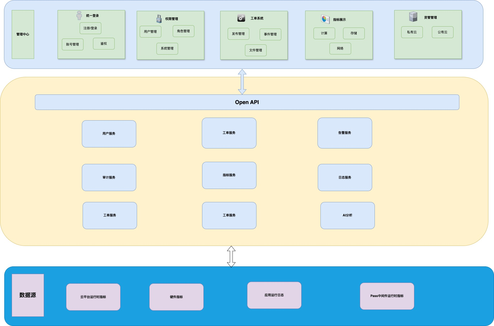

# 云管理平台

## Note

持续开发中 ...

## 介绍
云管理平台是一个综合性的解决方案，用于管理和调度多集群环境下的资源。该平台提供了用户管理、集群管理、节点管理、容器监控、事件管理、存储管理、网络管理、工作负载管理和系统管理等多种功能。通过统一的界面和API，用户可以方便地进行集群配置、应用部署、资源监控和事件处理，提高资源利用效率和系统稳定性。

### 架构图
下图展示了云管理平台的整体架构：

### 功能文档
有关更多详细的功能规范，请参阅 [功能文档](./doc/function.md)。

### API 文档
有关更多详细的 API 规范，请参阅 [API 文档](./doc/API/kubernetes_management_system.openapi.md)。

